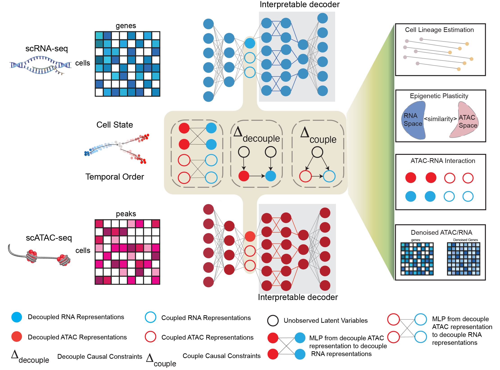

# HALO: Hierarchical Causal Modeling for Single Cell Multi-Omics Data
[arXiv](https://www.biorxiv.org/content/10.1101/2022.10.17.512602v6)
[BibTeX](#bibtex)

<p align="center">
    
</p>

Official code for the paper [HALO: Hierarchical Causal Modeling for Single Cell Multi-Omics Data ]

Please [cite us](#bibtex) when making use of our code or ideas.

## Installation
<p align="left">
    <a href="https://www.python.org/downloads/"></a>
    <a href="https://pytorch.org/get-started/previous-versions/"></a>
    <a href="https://black.readthedocs.io/en/stable/"></a>
    <a href="https://anaconda.org/anaconda/conda"></a>
</p>

```shell
cd $PROJECT_DIR
conda config --append channels conda-forge
conda create -n halo-env --file requirements.txt
conda activate halo-env
```


## Tutorial Notebook
### 1. the training tutorial: train_tutorial.ipynb
### 2. the representation analysis tutorial: tutorial_1_representation.ipynb
### 3. the gene-peak level analysis tutorial: tutorial_2_gene_peaks.ipynb
### 4. the granger causal analysis tutorial: tutorial_3_granger.ipynb
### 5. the chromatin potential tutorial: tutorial_3_Chromatin.ipynb  
### 6. the optimal transport analysis tutorial: tutorial_3_Chromatin.ipynb  


## License
[](https://creativecommons.org/licenses/by-nc-sa/4.0/)  
<!-- `[](https://creativecommons.org/licenses/by-nc-sa/4.0/)` -->
#### Attribution-NonCommercial-NoDerivatives 4.0 International
[](https://creativecommons.org/licenses/by-nc-nd/4.0/)  
<!-- `[](https://creativecommons.org/licenses/by-nc-nd/4.0/)`   -->


<!-- ## Multimodal Experiment

Download the dataset [Multimodal3DIdent](https://zenodo.org/records/7678231) [Daunhawer et al. ICLR 2023]:
```shell
# download and extract the dataset
$ wget https://zenodo.org/record/7678231/files/m3di.tar.gz
$ tar -xzf m3di.tar.gz
```
Training and evaluation:
```shell
# train a model with three input views (img0, img1, txt0)
python main_multimodal.py --dataroot "$PATH_TO_DATA"  --dataset "multimodal3di"

# evaluate
python main_multimodal --dataroot "$PATH_TO_DATA" --dataset "multimodal3di" --evaluate
```
# Acknowledgements
This implementation is built upon [multimodal-contrastive-learning](https://github.com/imantdaunhawer/multimodal-contrastive-learning) and [ssl_identifiability](https://github.com/ysharma1126/ssl_identifiability). -->

## BibTex

<!-- ```bibtex
@inproceedings{
    yao2024multiview,
    title={Multi-View Causal Representation Learning with Partial Observability},
    author={Dingling Yao and Danru Xu and S{\'e}bastien Lachapelle and Sara Magliacane and Perouz Taslakian and Georg Martius and Julius von K{\"u}gelgen and Francesco Locatello},
    booktitle={The Twelfth International Conference on Learning Representations},
    year={2024},
    url={https://openreview.net/forum?id=OGtnhKQJms}
}
``` -->
